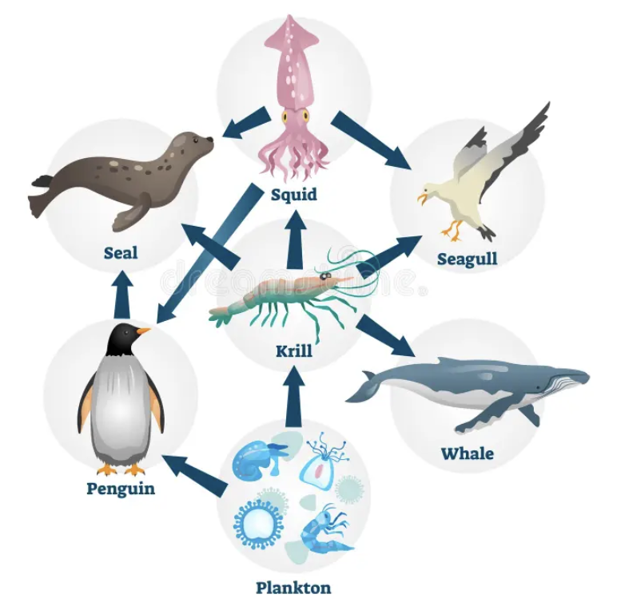
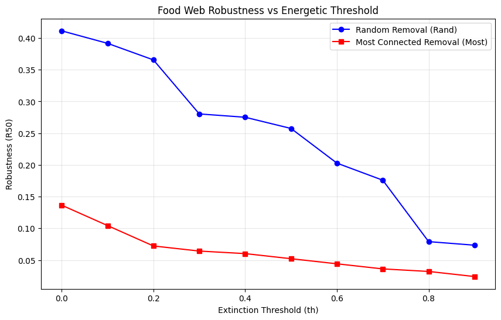
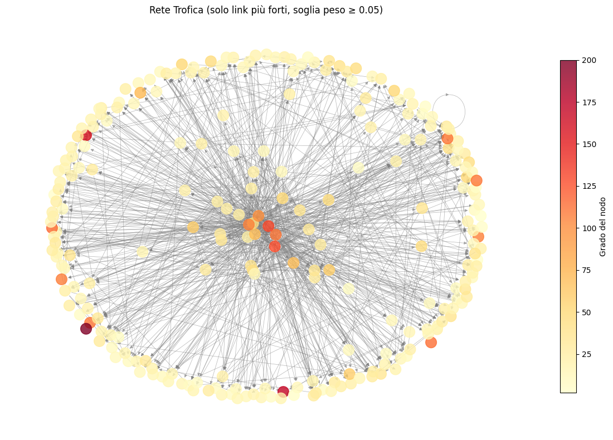
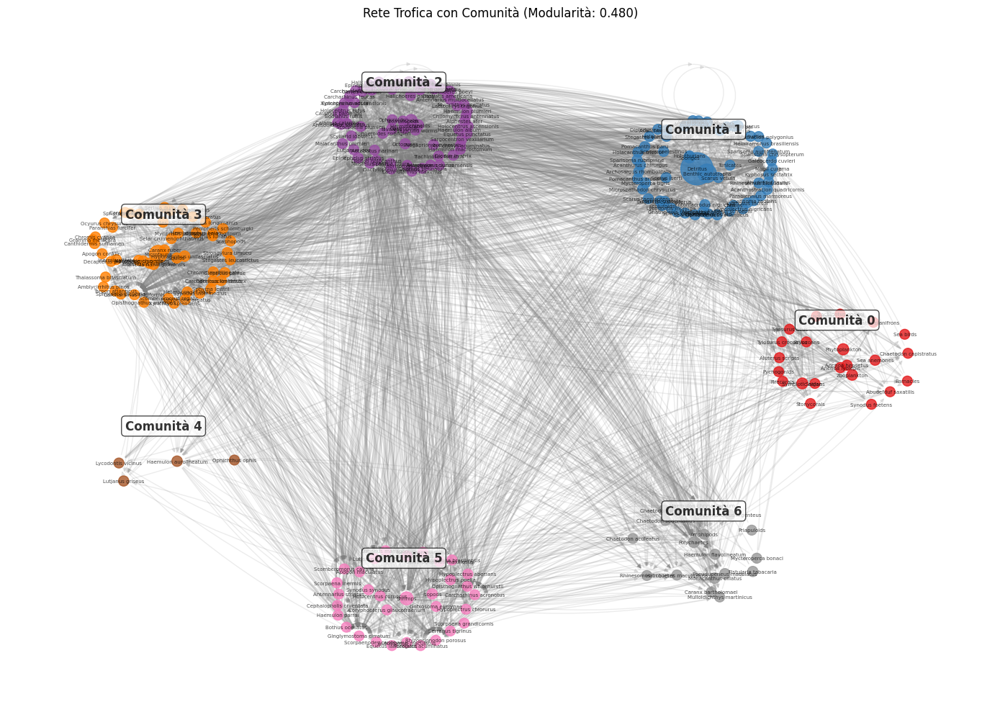
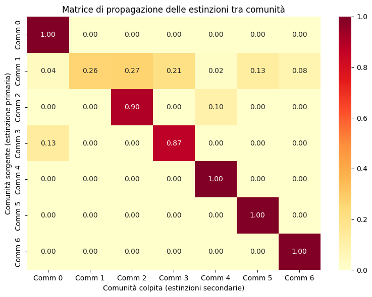
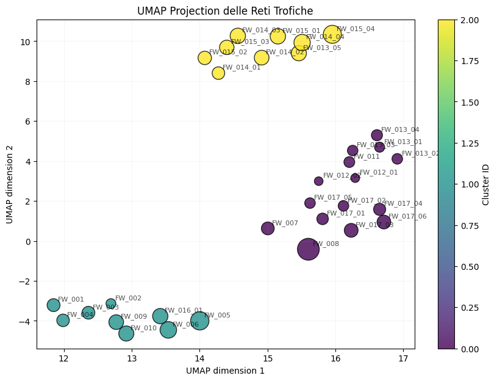
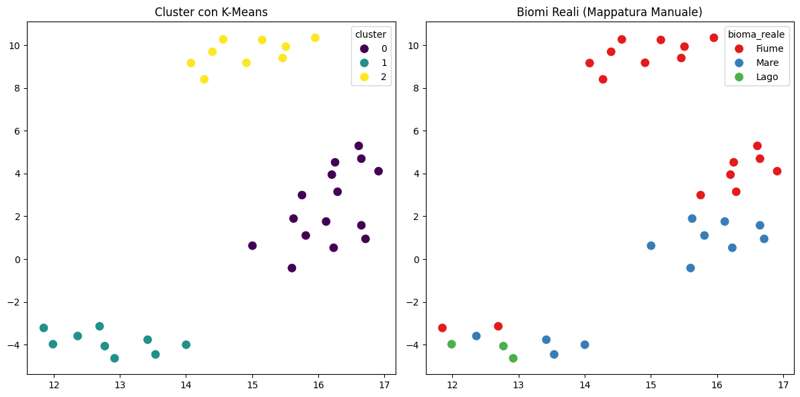
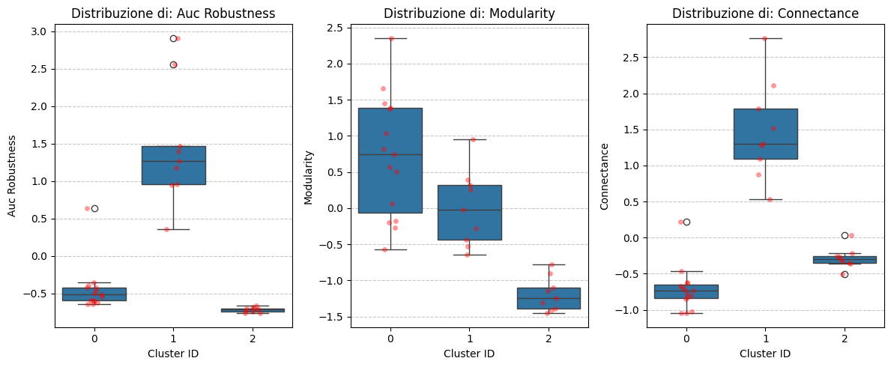
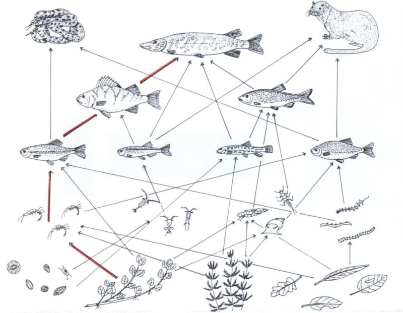

<!-- _class: title -->
<!-- _paginate: false -->

# Analisi di Reti Trofiche
## Utilizzo di tecniche non supervisionate per l'analisi di reti trofiche

 
 
 

**Daniele Molinari**
Progetto di Laboratorio di Intelligenza Artificiale

---

# Introduzione

Le **reti trofiche** sono grafi diretti pesati che modellano 
le relazioni predatore-preda in un ecosistema:
- **Nodi** — Specie
- **Archi** — Flusso di energia (preda → predatore)
- **Pesi** — Intensità dell'interazione

 
 

**Domanda centrale:**
> *Cosa succede quando una specie si estingue? Come si propaga l'effetto nella rete?*

---

# Obiettivi del Progetto

Il progetto si articola in **due parti**:

1. **Analisi singola rete**: Simulare estinzioni a cascata e verificare se le comunità **compartimentalizzano** il danno
2. **Analisi Esplorativa**: Identificare pattern strutturali comuni tra 33 reti trofiche

 
 

**Dataset:** Web of Life — reti ecologiche reali da ecosistemi marini, fluviali e di lago

---

# Il Modello Energetico (Bellingeri et al.)

Una specie si estingue quando l'energia in ingresso scende sotto una **soglia critica**:

 

$${E_{\text{corrente}} \leq th \times E_{\text{iniziale}}}$$

 

Quindi, ad esempio:
- $th = 0.5$:  Estinzione se energia scende sotto il 50% 
- $th$ alto: Rete fragile
- $th$ basso: ete robusta 

---

# Indice di Robustezza $R_\alpha$

 
 

Una prima analisi di robustezza della rete è stata qella di quantificare quante **estinzioni primarie** sono necessarie per causare $\alpha$% di estinzioni totali:

$$R_\alpha = \frac{E_{\text{primarie}}}{S}$$

 

---

# Community Detection

- **Ipotesi:** Le reti trofiche hanno struttura modulare.  
Un'estinzione dovrebbe colpire principalmente la propria comunità.

- **Metodo:** Algoritmo di Louvain (massimizza la modularità)

- Sulla rete **FW_008** (Caribbean Marine Food Web):
    - 249 specie, 3313 interazioni
    - Modularità: 0.48
    - 7 comunità identificate

---

# Visualizzazione delle Comunità

 
 

---

# Propagazione delle Estinzioni

 
 

Nella seguente **heatmap** è possibile vedere come sono distribuite le estinzioni secondarie causate dalle estinzioni primarie.

---

# Parte 2: Analisi Esplorativa

 

**Obiettivo:** Identificare pattern comuni tra **33 reti trofiche** da ambienti diversi. Per farlo verifichiamo la formazione di cluster naturali.

**Feature estratte per ogni rete:**

 

| Feature | Cosa misura |
|---------|-------------|
| `Size` | Numero di nodi nella rete (specie) |
| `connectance` | Densità dei link ($L/S^2$) |
| `modularity` | Struttura a comunità |
| `avg_energy_flow` | Intensità media delle interazioni |
| `auc_robustness` | Fragilità globale (area sotto curva impatto) |

---

# Pipeline di Clustering

1. **StandardScaler** — normalizzazione delle feature
2. **UMAP** — riduzione dimensionale (preserva struttura locale)
3. **K-Means** — clustering con scelta automatica di K

**Scelta di K:** Silhouette Score → $K_{opt} = 3$

---

# Biomi vs Cluster

 
 

**Ipotesi:** I cluster corrispondono ai biomi (mare, fiume, lago)?

 

 

**Risultato:** No. Reti di ambienti diversi finiscono nello stesso cluster.

---

# Interpretazione dei Cluster

 
 

- **Cluster 0**: Bassa connettività, modularità media e Robusto
- **Cluster 1**: Alta connettività, bassa modularità e Fragile
- **Cluster 2**: Alta modularità, estinzioni localizzate e Intermedio

 

---

# Conclusioni

I risultati indicano che reti con simili livelli di modularità e connettività tendono a condividere anche livelli simili di fragilità, evidenziando un pattern strutturale coerente tra organizzazione topologica e robustezza della rete.

 

**Implicazione:** La protezione delle specie hub e il monitoraggio della struttura topologica sono priorità per la conservazione.

---

<!-- _class: title -->
<!-- _paginate: false -->

# GRAZIE PER L'ATTENZIONE

 

**Repository**: github.com/osryde/trophic_graph_analysis
**Demo**: Vediamo un esempio di rete poco connessa
